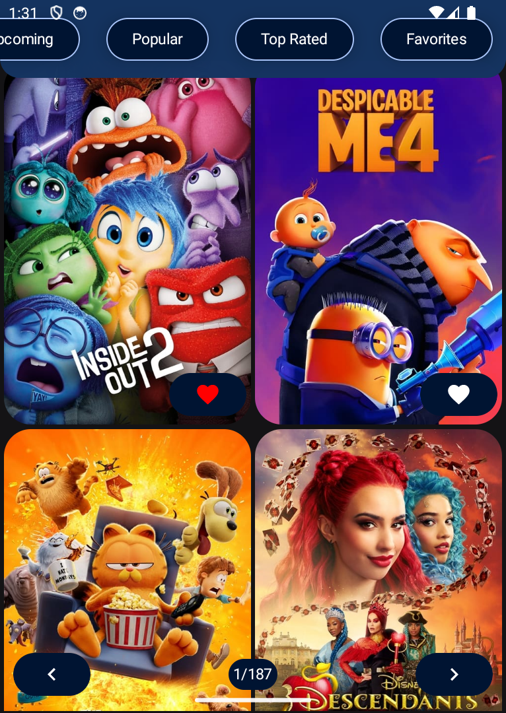
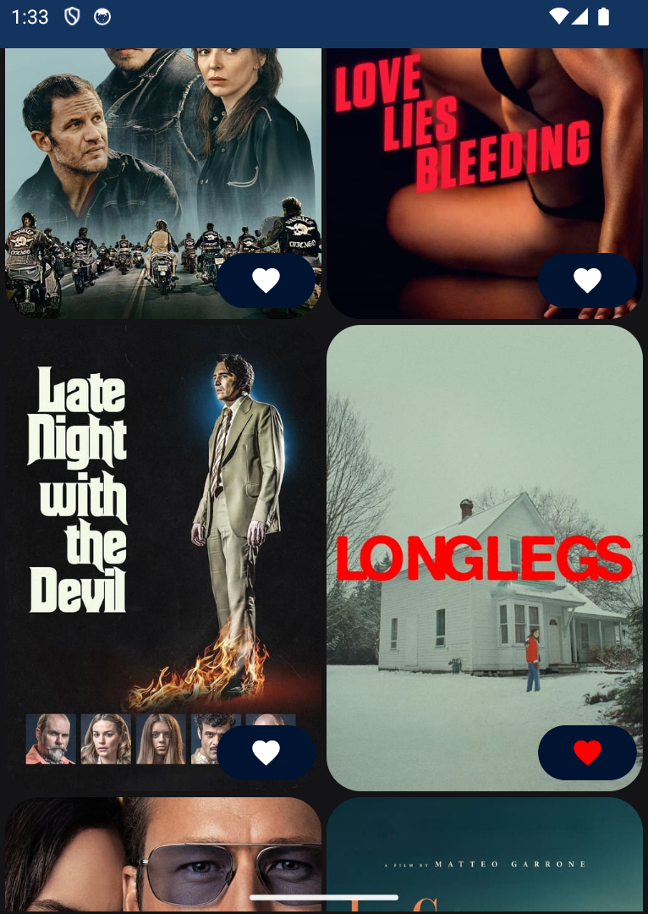
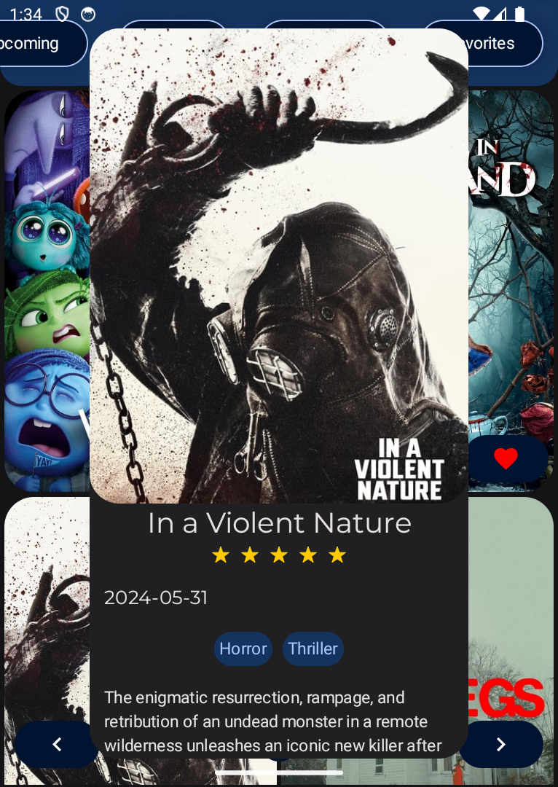
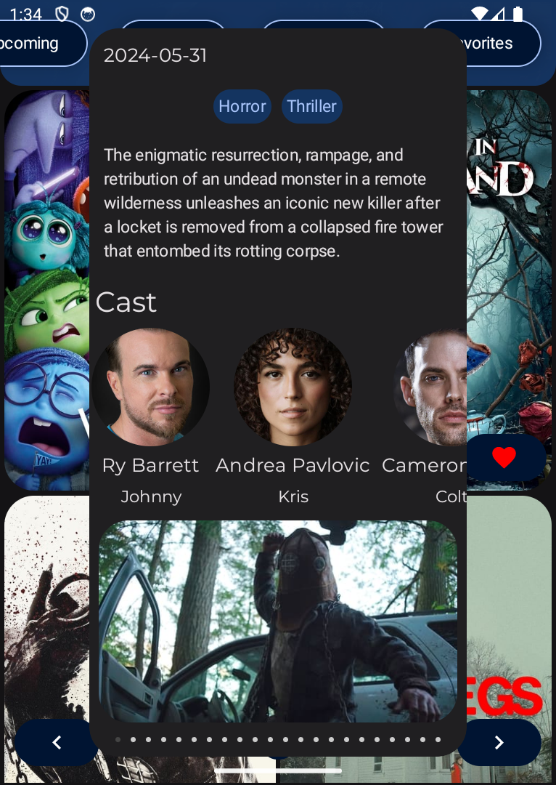

# Movie App

This is an Android app developed using Kotlin and adhering to the MVVM (Model-View-ViewModel) architecture pattern.
The app uses Retrofit to fetch data from The Movie Database (TMDB) API and displays the latest and most popular movies with detailed information including summaries, ratings, languages, and posters.

## Screenshots

  
*Displays Latest and Popular Movies*

  
*Displays Latest and Popular Movies with Collapsed UI*

  
*Detailed Movie Information*

  
*Detailed Bottom Movie Information*

## Features

- **Displays Latest and Popular Movies**: Shows the most recent and trending movies.
- **Detailed Movie Information**: Provides movie details including summary, rating, language, and poster.
- **MVVM Architecture**: Implements the MVVM pattern for a clean separation of concerns.
- **Retrofit Integration**: Fetches movie data from the TMDB API.
- **RoomDB Integration: Fetches favorite movie data from the local database and stores user preferences.
- **Save to Favorites: Allows users to save movies to their favorites list.
- **Smooth User Experience**: Ensures a responsive interface by using background threads.

- ##API Reference
- This app utilizes the The Movie Database (TMDB) API to fetch movie data.

- ##Conclusion
This movie app showcases the use of Kotlin, MVVM architecture, and Retrofit to create a functional and user-friendly Android application. It integrates with The Movie DB API to display movie details in a clean and intuitive manner. Future enhancements are planned to expand functionality and improve user experience.
